# Shri Shanta - Hostel Management System

A full-stack web application designed to efficiently manage hostel operations including student management, room allocation, complaints, attendance, and mess menu management.

---

## Description

Shri Shanta Hostel Management System simplifies traditional hostel management by digitizing:

- Student attendance records
- Room allocation
- Complaint handling
- Mess menu management

The system supports multiple roles such as **Admin, Warden, Student, and Maintenance Staff**, making it a complete solution for hostel administration.

---

## Features

### Admin
- Add / manage students
- Assign rooms
- Upload student data via Excel
- Dashboard overview

### Student
- View attendance
- Submit complaints
- View mess menu

### Maintenance Department
- Manage complaints
- Track workers
- Dashboard overview

### Warden
- Manage mess menu
- Assign rooms
- Generate attendance reports
- Track attendance

---

## Tech Stack

### Frontend
- React.js
- TypeScript
- HTML5
- Tailwind CSS

### Backend
- Node.js
- Express.js

### Database
- MySQL (via mysql2)

### Other Libraries
- Multer (file uploads)
- XLSX (Excel handling)

---

## 📂 Project Structure
```
ShriShanta/
│
├── src/ # React frontend
│ ├── components/
│ ├── pages/
│ │ ├── Admin/
│ │ ├── student/
│ │ ├── warden/
│ │ └── maintenance_department/
│ ├── context/
│ ├── hooks/
│ └── lib/
│
├── public/ # Static assets
├── uploads/ # Uploaded Excel files
├── screenshots/ # Project screenshots used in README
├── README.md # Project documentation
├── package.json # Project dependencies and scripts
```
---

## ⚙️ Installation & Setup

⚠️ **Note:** `node_modules` folder is intentionally removed to reduce project size.

### 🔹 Step 1: Clone Project

```bash
git clone <your-repo-link>
cd hostel-hub-main
```

### 🔹 Step 2: Install Dependencies
Run this in root:

```bash
npm install
```

### 🔹 Step 3: Start Backend (Node + Express)
since we are using nodemon

```bash
npx nodemon index.js
```

### 🔹 Step 4: Start Frontend (React + Vite)

```bash
npm run dev
```
---

## API Endpoints (Sample)

GET    /students        → Fetch all students
POST   /students        → Add new student
PUT    /students/:id    → Update student
DELETE /students/:id    → Delete student

POST   /upload          → Upload Excel file
GET    /complaints      → Fetch complaints

## Key Functional Modules
- Excel Upload System (Student Data)
- Room Allocation System
- Complaint Management
- Attendance Tracking
- Mess Menu Management
- Role-Based Access

## Screenshots

Below are some key interfaces of the Shri Shanta Hostel Management System:

### Role-Based Login page
Common for student, warden and Maintenance Department
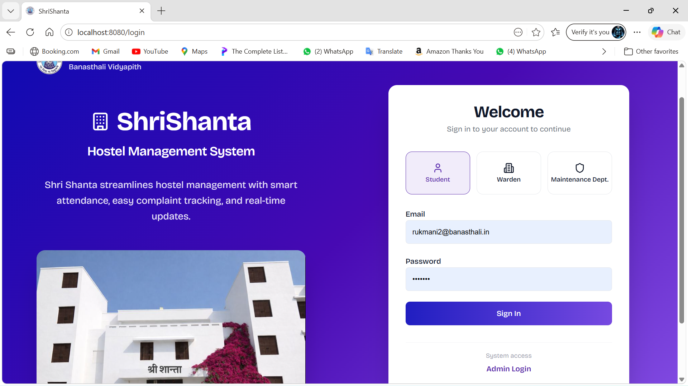

### Dashboard
Student Dashboard
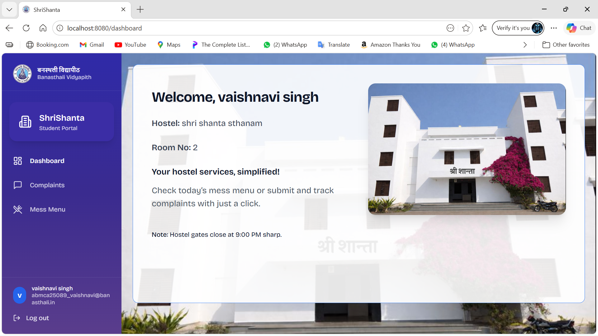

### Student Complaints
Interface where students can view and raise complaints
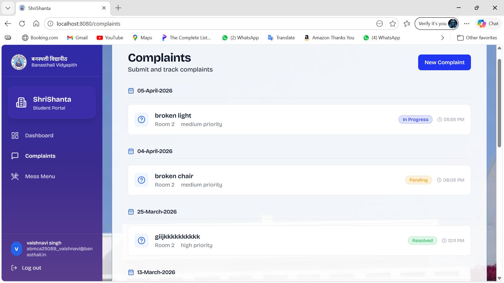

### Student Mess Menu
Interface where students can view their respective hostel mess menu
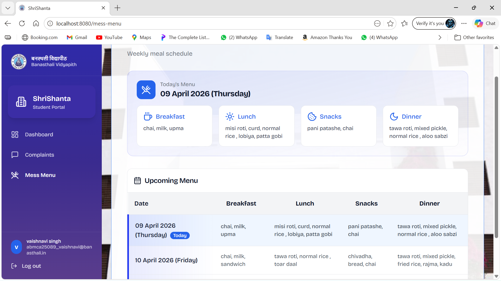

---

### Warden Attendance
Warden interface where she can take attendance
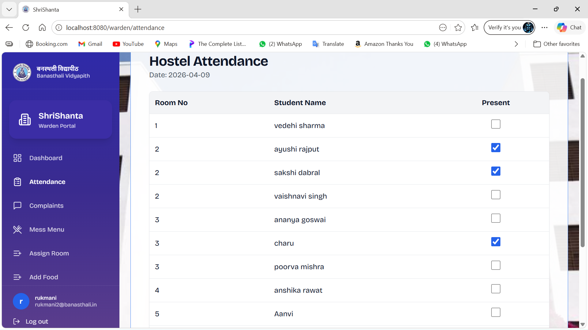
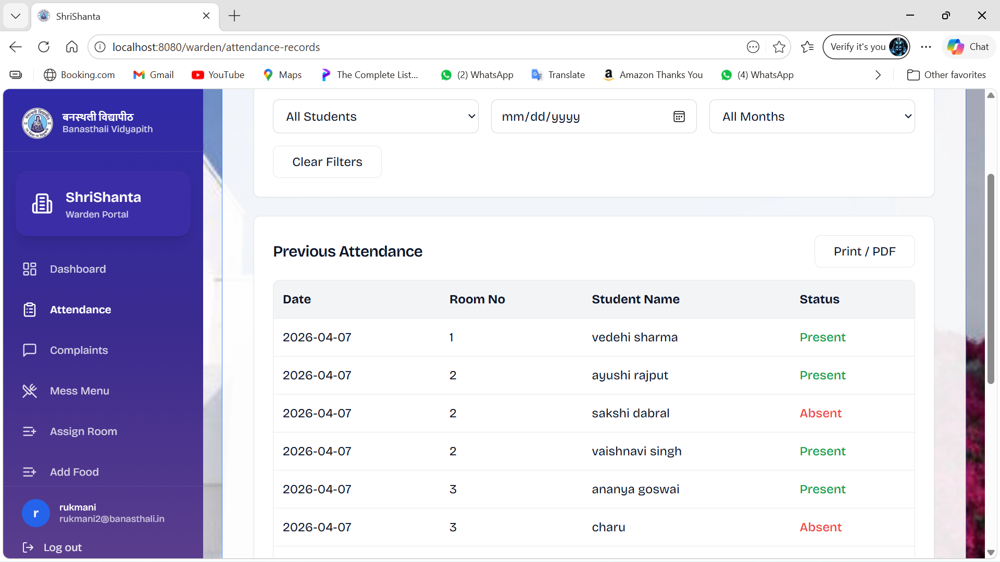

### Warden Complaint
Warden interface to check complaints of their respective hostel
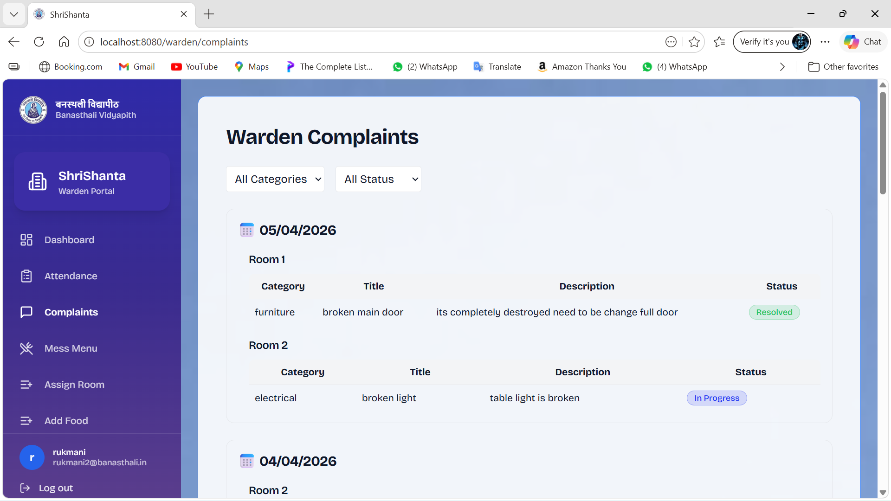


### Mess Menu Management
Warden interface to manage mess menu and view meal schedules.
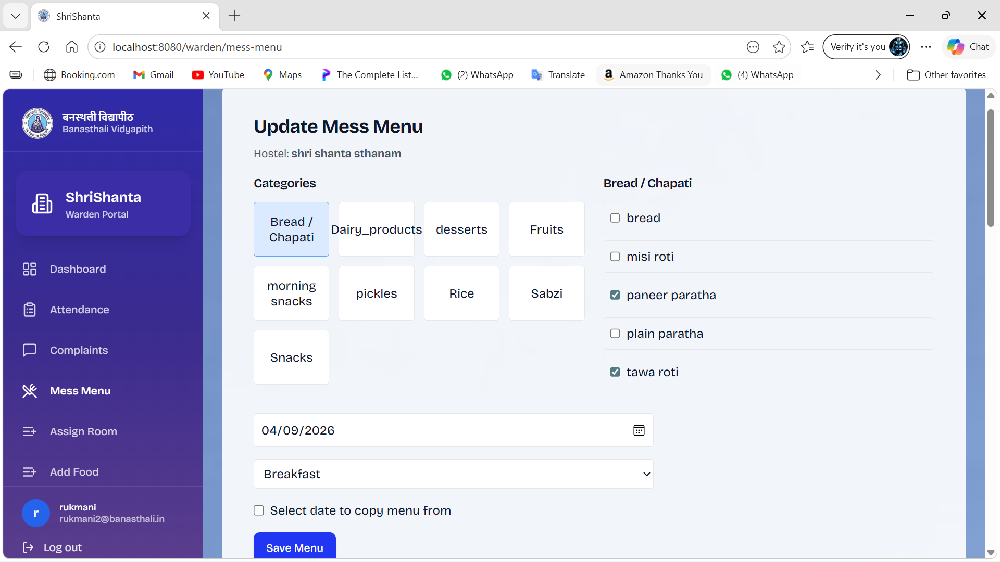

### Assign Room
Warden interface to manage and assign rooms
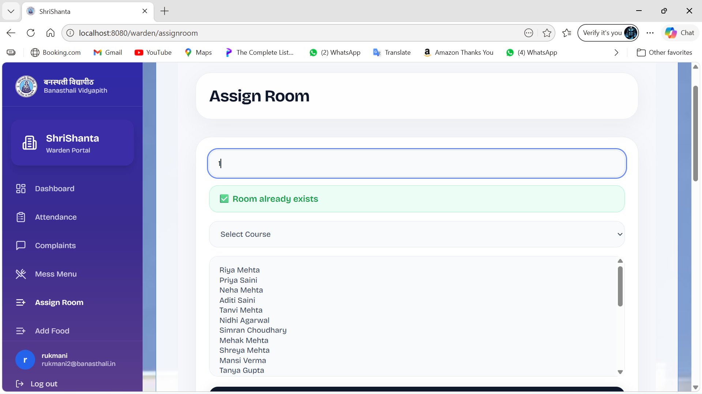
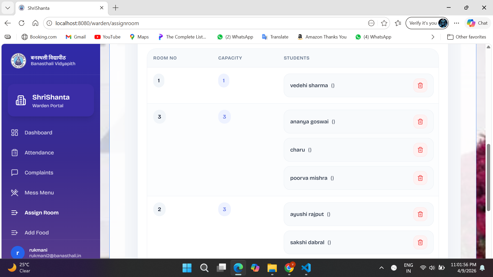

---

### Maintenance Department Complaint
Maintenance Department interface to check complaints of all hostels
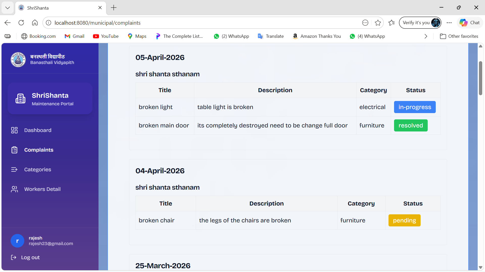

### Worker Details
Maintenance in-Charge interface to manage worker details call log 
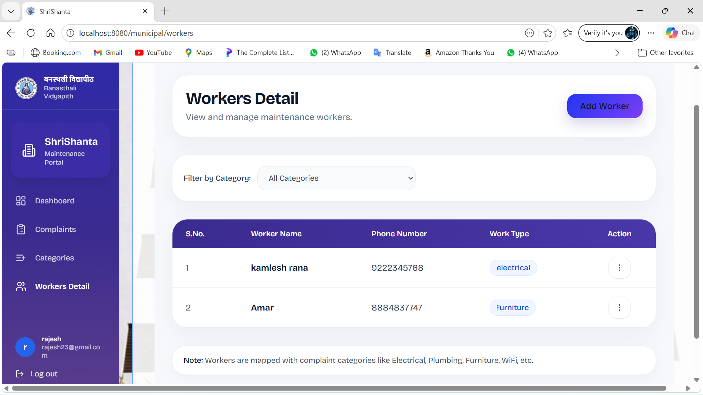

---

### Admin Login 
Separate login page for Admin
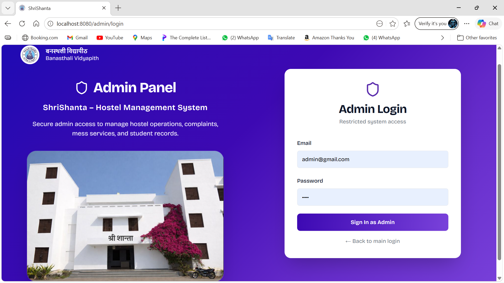

### Admin assign course
Admin interface to assign courses to hostels
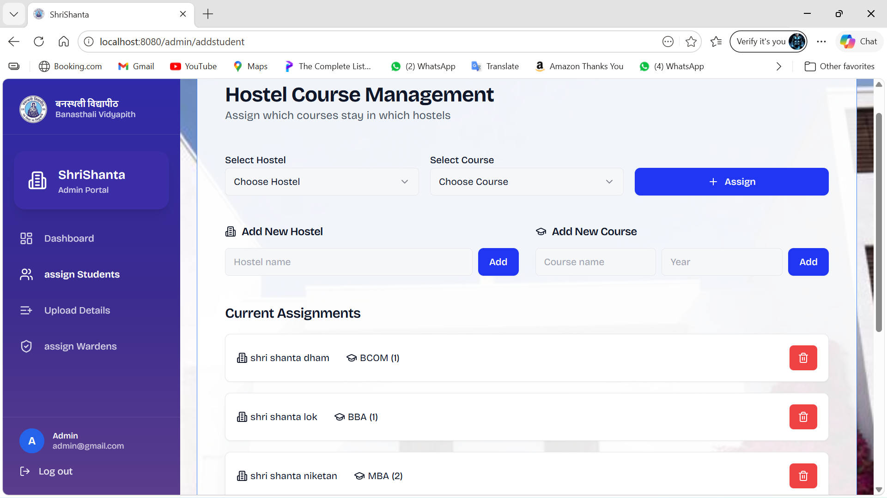

### Admin assign wardens
Admin interface to assign wardens to hostels
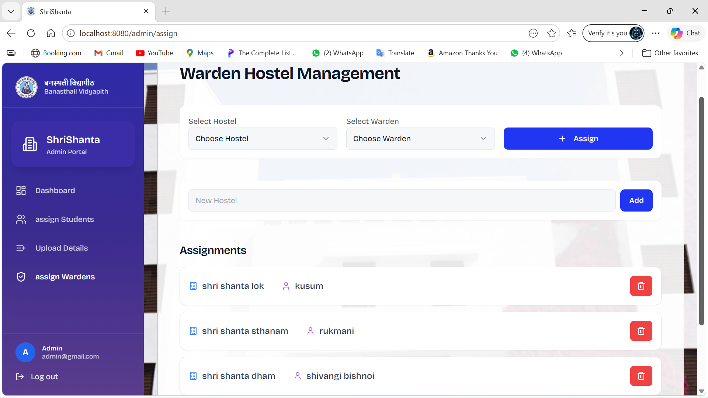

### Admin Upload Data
Admin interface to upload data of students and wardens
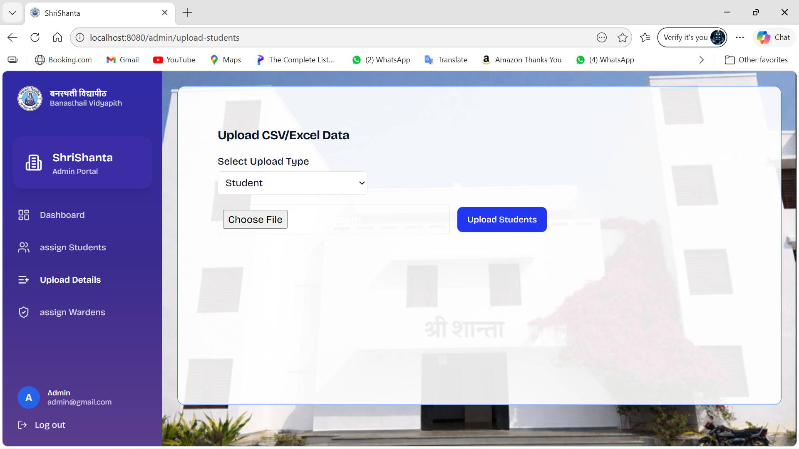

---

## Future Enhancements
- Report generation of Mess Menu and Complaints by Warden
- Report generation of Complaints by Maintenance Department
- Report Generation by Admin for all functions of Hostel
- Worker Assignment by Maintenace Department

## Contributors
- Vedehi Sharma
- Vaishnavi Singh
- Sakhi Dabral
- Poorva Mishra

## License
This project is being developed for Banasthali Vidyapith

## Acknowledgement
- Mentor Dr. Kuldeep Yogi
- React Documentation
- Node.js & Express Docs
- MySQL Documentation